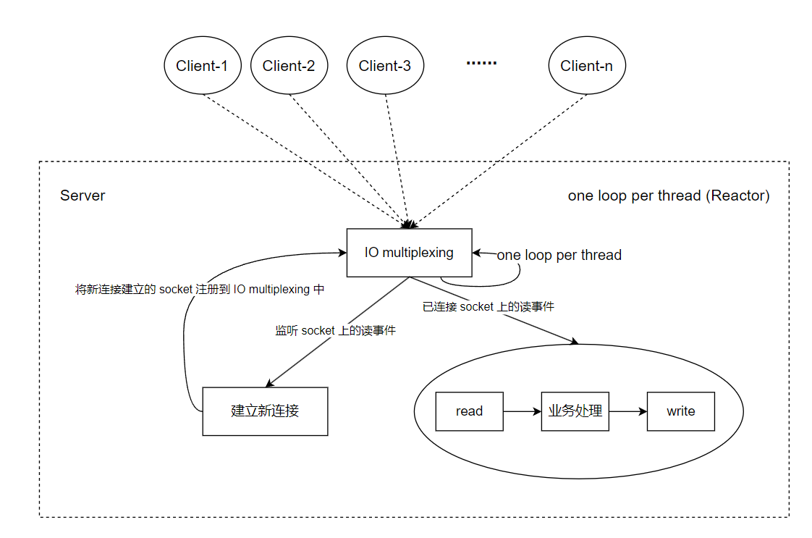

在 TCP 网络编程中，这里我们特指在单机的环境下，主要关注两件事。第一，如何正确的处理TCP的连接和断开，以及正确处理数据的收发；在错综复杂的网络环境中，这并非易事，涉及很多细节，我会单独另写一篇文章，尝试讨论这个话题。第二，如何榨干机器的性能，即如何让单台机器在已有的硬件条件下处理尽可能多的连接请求；这需要设计一种高效的网络模型，这是本文讨论的主题，即在 muduo 网络库源码的学习基础上，总结和讨论。

下面进入本文的主题。

在TCP网络编程中，我们关注的核心是，在一个小的时间片段中，如何能够处理更多的并发连接。这主要可以从三个方面展开，而从一个服务端程序的性能指标来看，这三个方面分别为：响应时间、吞吐量和并发连接数。
- 响应时间。响应时间是指请求发送到收到响应的时间。从程序本身来看，当收到客户端发来的请求时，TCP服务端需要能够立马处理，并将处理结果立马发送回客户端。更具体地，在面对短时间内有大量的请求到来时，TCP服务端要做尽可能地做到不阻塞在某个或某些请求处理上。这表现为，在错综复杂的网络环境中，数据的收发是不确定性，TCP服务端不能阻塞在socket上的读写上，这就要求socket是非阻塞的（nonblocking IO）。
- 吞吐量。吞吐量是指单位时间内处理的请求数量。我们希望每个单机的TCP服务程序在单位时间内能够处理尽可能多的请求，这对于单核的CPU很容易就达到瓶颈，而对于多核的CPU，我们希望尽可能把每个核都跑满，使其处理充分多的请求，这就要求TCP服务程序具有很好的多线程网络模型，而下文中介绍的 one loop per thread 网络模型就可以很好的和多线程结合。
- 并发连接数。并发连接数是指服务程序同时能够处理的连接数量。每个连接最少需要一定的内存资源，因此并发连接数会受计算机硬件的影响；此外每个连接至少需要一个socket文件描述符，而操作系统中的文件描述符数量是有限的，因此并发连接数会受到操作系统软件资源的影响。此外，从TCP服务程序本身来看，TCP服务程序可以同时保持很多连接，但在同一时刻处理这些已连接的请求的数量是少于总连接的数量的，同时TCP服务程序要需要处理源源不断带来的新连接，以及因为连接超时等原因关闭的连接，这就要求我们使用IO复用技术（IO multiplexing）。

小结一下，为降低响应时间，需要使用 nonblocking IO；为并发连接数尽可能大，需要使用 IO multiplexing；为了提高吞吐量，在程序上需要设计良好的多线程网络模型。下面就正式介绍 one loop per thread 网络模型，它是基于 nonblocking IO 和 IO multiplexing 的。

one loop per thread 网络模型，也称为 **Reactor** 模型。loop指事件循环，将文件描述符可读称为一个可读事件，将文件描述符可写称为一个可写事件，在TCP网络编程中，我们重点关注socket文件描述符上的读写事件。事件循环是指监控文件描述符上的读写事件，当有文件描述符变得可读或可写时，理解为发生了一次事件循环，即检测到一次事件发生。事件循环是依赖于 IO multiplexing 的。综上，one loop per thread 指每个线程中只有一个事件循环。

如下图所示，先来看下在单线程下，one loop per thread 网络模型长什么样子。

单线程下 one loop per thread 网络模型的TCP连接处理流程：
- 服务端阻塞在 IO multiplexing 函数调用，等待客户端的请求到来。
- 当客户端发送请求给服务端，IO multiplexing 函数检测到读事件，解除阻塞，然后获取产生读事件的 socket 文件描述符，从socket文件描述符上读取数据进行处理。在 IO multiplexing 函数中监控的 socket 文件描述有两类，一类是已连接的 socekt 文件描述符，一类是监听是否有新连接到来的 socket 文件描述符。
	- 对于监听socket上的读事件，调用 accept() 函数接收一个新的连接请求，并获取新连接的 socket 文件描述符，然后将其注册到 IO multiplexing 函数中。
	- 对于已连接的 socket 上的读事件，进行 read() --> 业务处理 --> write() 的处理流程。

one loop per thread 网络模型通过 nonblocking IO + IO multiplexing 可以很好的同时处理新连接和已连接，但存在的问题也显而易见，因为是单线程，你处理能力受限，且当已连接的处理比较耗时，新连接的响应时间就会受到影响。若已连接的处理比较耗时，比如是CPU密集计算任务，一种解决方案是，另起线程做CPU密集祭祀按任务，不让其影响IO线程，从而影响响应时间。当然这在单线程环境下都无从说起。

发挥 one loop per thread 网络模型能力的场合时多线程环境，通过将新连接的处理和已连接的处理分发到不同线程，来提高吞吐量。其本质是让已连接的处理不会影响新连接的处理。多线程下的 one loop per thread 网络模型如下图所示。

多线程 one loop per thread 网络模型下，每个线程中运行一个 loop，且每个线程最多运行一个 loop。在这个网络模型下，有一个主线程，有的博客中也称为主Reactor（Main Reactor）。主线程主要干两件事，第一，管理监听socket，当有新连接到来，即监听socket可读，调用 accept() 建立一个新连接；第二，获取新连接的 socket 后，将其分发到一个子线程中的 IO multiplexing 函数中，之后这个已连接 socket 上的读写事件主线程就不再负责，被分发到的子线程始终管理着这个已连接socket上的读写事件，直到这个连接关闭。

多线程的 one loop per thread 网络模型的优点：
- 将新连接处理和已连接处理分离在不同的线程处理，兼顾服务程序的响应事件和吞吐量。
- 监控 socket 上读写事件的线程是固定的，即不存在A线程监控读事件B线程监控写事件的情况，事件处理的流程简单。
- 任务在线程之间的调配安全简单。在A线程调用B线程管理的socket上的回调函数，最终会转入B线程执行调用。（将在《muduo源码分析之Channel、EventLoop和Selector》的文章中详细介绍）

总结：上述描述的 one loop per thread 网络模型主要涉及网络的IO，也即主要关心 socket 的读写事件，这是网络库关心的核心问题之一。因此，有时又将具有事件循环的线程称为IO线程。一个高效的网络库的核心工作是要能够处理足够大的并发量，即IO事件，当请求中涉及CPU密集计算任务时，不能让其在IO线程中占用过多的CPU资源，这样会影响到IO线程上的其他连接，一种解决办法是，为CPU密集计算任务开辟单独的线程或线程池，通过例如消息队列的形式将密集计算任务分发给这些线程， one loop per thread 模型可能很轻松进行这样的结合。