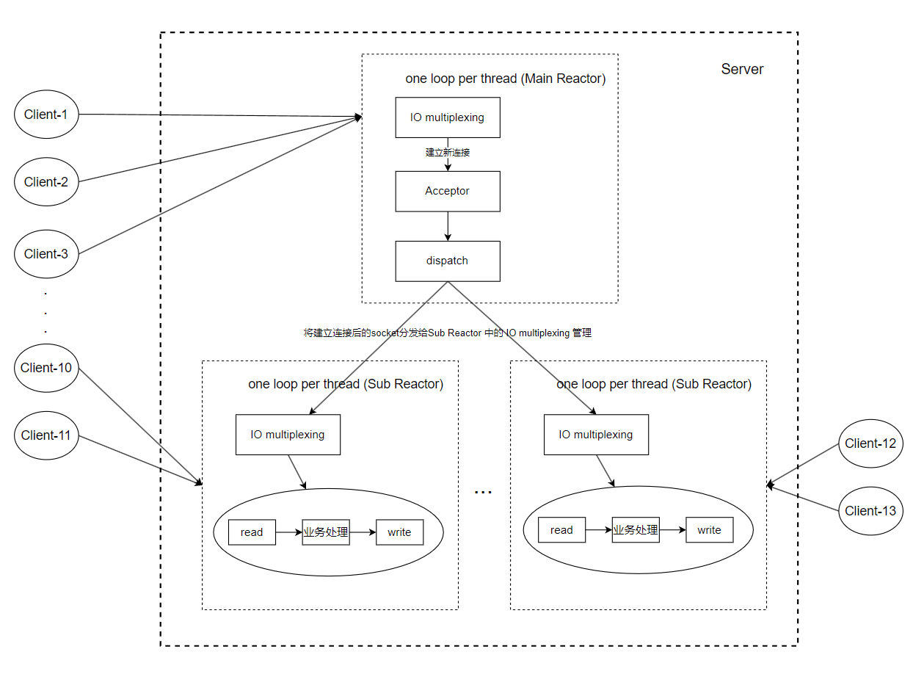

# A Simple TCP NetWork Library


Linux下基于C++17实现的TCP网络库

## 概述
本项目是对 [muduo](https://github.com/chenshuo/muduo) 网络库的一个重新实现版本，具有以下特点：
- 延用 muduo 中的多Reactor多线程模型（即one loop per thread）作为并发模型。
- 尽可能的使用C++标准库替换 muduo 中自己封装的一些组件。例如，使用C++中提供的并发提供工具 thread、mutex等替换 POSIX 提供的并发接口，使用C++17中的 string_view 替换 StringPiece 等。
- 实现了同步/异步日志功能。目前只支持将日志输出到控制台和文件，异步日志采用的仍然是muduo中的双缓冲buffer的思想，但对其实现进行了重构。

目前本项目算是第一个版本，只实现了一个TCP服务程序的基本功能，仍有许多功能待实现和完善，待继续实现和完善的部分将在[更新计划](#更新计划)中持续更新。


## 快速使用
### 环境
请使用支持 C++17 及以上的编译器。我的开发环境为：
```markdown
Ubuntu 20.04
g++ 11.3
cmake 3.16.3
make 4.2.1
```

### 使用
```shell
./build.sh
```

目前还为基于本网络库写上层的应用，已加入 [更新计划](#更新计划)。
可以查看 [tests](./tests/) 目录下相应的测试代码。


## 框架



## 庖丁解牛
- [one-loop-per-thread核心原理](./docs/one-loop-per-thread核心原理.md)
- [源码分析之Channel、EventLoop和Selector](./docs/源码分析之Channel、EventLoop和Selector.md)
- [定时器](./docs/定时器.md)
- 更新中...


## 更新计划
- [ ] 完善测试代码
- [ ] 增加性能测试
- [ ] 增加 examples 中的示例

保持更新...